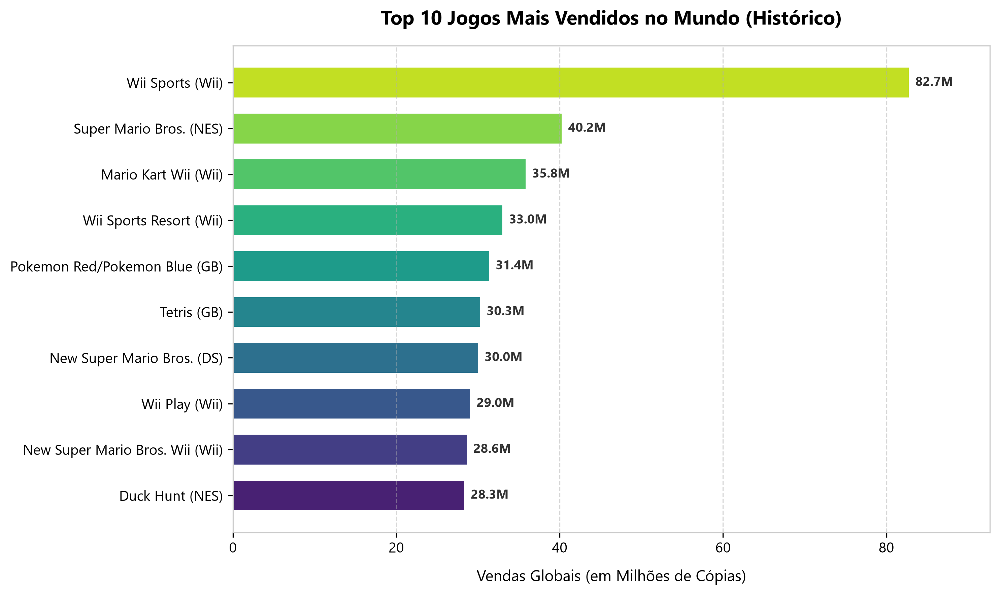
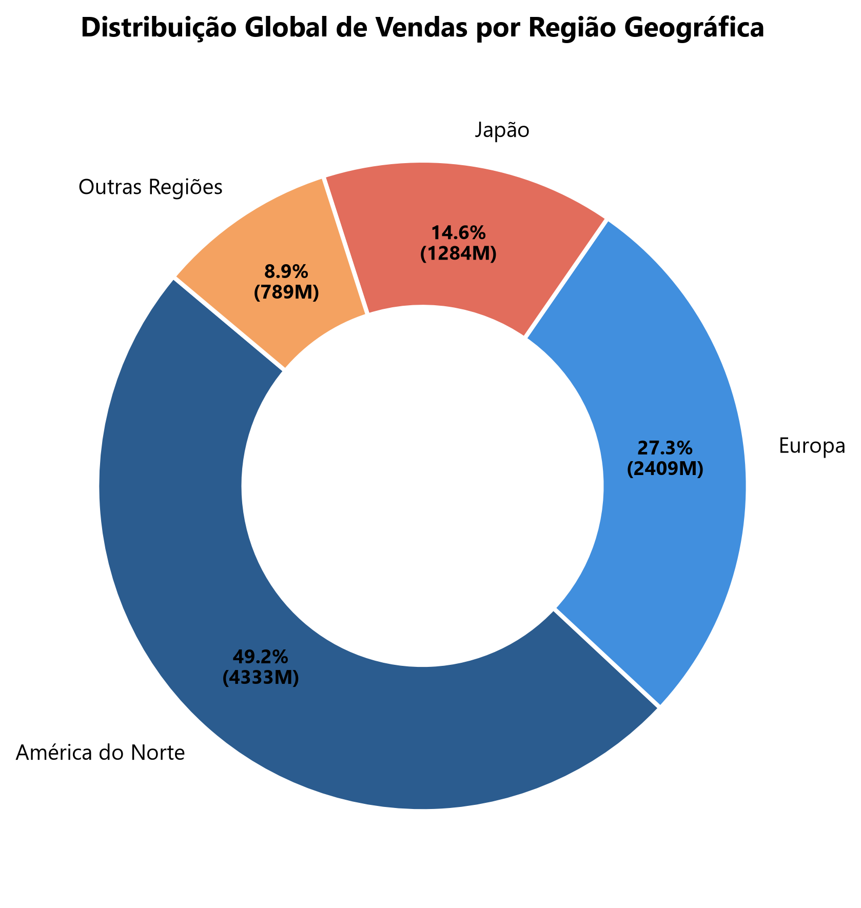
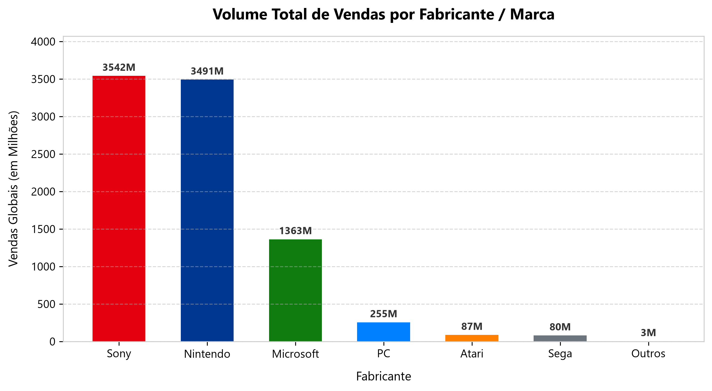
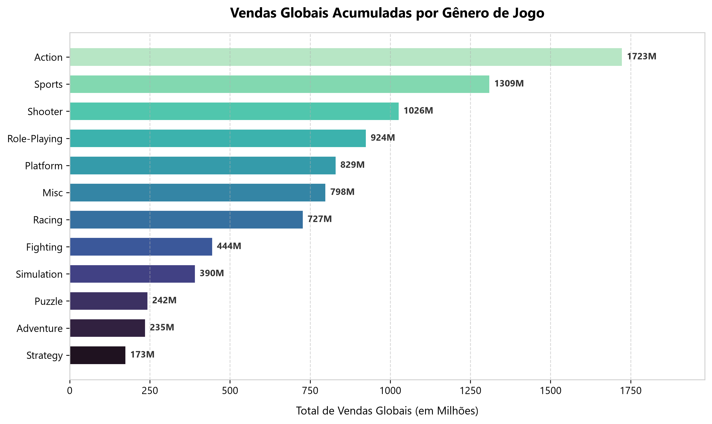

# 🎮 Análise de Vendas da Indústria de Games

[](https://www.python.org/)
[](https://pandas.pydata.org/)
[](https://powerbi.microsoft.com/)
[]()

Projeto prático de **Engenharia de Dados (ETL), Análise Exploratória e Business Intelligence (BI)** sobre o histórico global de comercialização de videogames nas últimas quatro décadas.

> **Status do Projeto:** Entrega 1/3 (Fundação de Dados, Pipeline ETL & Dashboard MVP)

---

## 📌 Escopo da Entrega 1

- **Pipeline de ETL em Python:** Tratamento, limpeza e enriquecimento do dataset original (`vgsales.csv`).
  - Tratamento de registros nulos e duplicidades lógicas.
  - Correção de inconsistências temporais e anomalias de catálogo.
  - Conversão de tipos de dados (`Year` tipado como inteiro).
  - *Feature Engineering*: criação de colunas analíticas (`Fabricante`, `Tipo_Plataforma`, `Decada`, `Maior_Mercado` e `Faixa_Vendas`).
  - Exportação da base estruturada em `UTF-8 com BOM` para integração nativa com o Power BI.
- **Visualizações Exploratórias:** Script automatizado (`gerar_graficos.py`) para geração dos gráficos de validação analítica.
- **Modelagem Analítica (Power BI):** Documentação de arquitetura e catálogo de medidas DAX em [`dashboard/MEDIDAS_DAX.md`](dashboard/MEDIDAS_DAX.md).
- **Estrutura de Governança:** Repositório padronizado e versionado com boas práticas de engenharia de software.

---

## 📊 Prévias da Análise Exploratória

Abaixo estão algumas das visualizações geradas automaticamente a partir dos dados tratados:

| Top 10 Jogos Mais Vendidos | Distribuição Regional de Vendas |
| :---: | :---: |
|  |  |

| Faturamento por Fabricante | Vendas por Gênero |
| :---: | :---: |
|  |  |

---

## 📖 Dicionário de Dados (Base Tratada)

A base resultante do pipeline (`vgsales_tratado.csv`) conta com 16 colunas:

| Coluna | Tipo | Descrição |
| :--- | :--- | :--- |
| **Rank** | `int` | Posição no ranking global de vendas |
| **Name** | `str` | Título do jogo |
| **Platform** | `str` | Sigla da plataforma original (ex: PS2, X360, Wii) |
| **Year** | `int` | Ano de lançamento do jogo |
| **Genre** | `str` | Gênero do título (Ação, Esportes, etc.) |
| **Publisher** | `str` | Empresa publicadora |
| **NA_Sales** | `float` | Vendas na América do Norte (em milhões) |
| **EU_Sales** | `float` | Vendas na Europa (em milhões) |
| **JP_Sales** | `float` | Vendas no Japão (em milhões) |
| **Other_Sales** | `float` | Vendas nas demais regiões do mundo (em milhões) |
| **Global_Sales** | `float` | Vendas globais totais (em milhões) |
| **Fabricante** | `str` | *Feature Criada:* Grupo/Marca da plataforma (Nintendo, Sony, Microsoft...) |
| **Tipo_Plataforma** | `str` | *Feature Criada:* Classificação (Console de Mesa, Portátil, Computador) |
| **Decada** | `str` | *Feature Criada:* Década de lançamento (Anos 80, 90, 2000, 2010+) |
| **Maior_Mercado** | `str` | *Feature Criada:* Região onde o jogo obteve maior receita |
| **Faixa_Vendas** | `str` | *Feature Criada:* Segmentação comercial (Super-Hit, Sucesso, Médio, Nicho) |

---

## 📁 Estrutura do Projeto

```text
ProjetoDeJogos/
├── Dados/
│   ├── Bruto/                  # Base original (vgsales.csv)
│   └── Tratado/                # Base limpa e enriquecida (vgsales_tratado.csv)
├── scripts/
│   ├── analise_inicial.py      # Exploração e estatísticas descritivas
│   ├── tratamento_dados.py     # Pipeline de limpeza e feature engineering (ETL)
│   └── gerar_graficos.py       # Geração automatizada de gráficos em alta resolução
├── dashboard/
│   ├── graficos/               # Imagens exportadas para relatórios e README
│   ├── MEDIDAS_DAX.md          # Fórmulas DAX e guia de layout para o Power BI
│   └── .gitkeep                # Diretório reservado para os arquivos .pbix
├── requirements.txt            # Dependências do ecossistema Python
├── .gitignore                  # Regras de exclusão (.venv, caches, etc.)
└── README.md                   # Documentação oficial do projeto
```

---

## 🚀 Como Executar (Ambiente Local)

### 1. Clonar o Repositório e Preparar Ambiente
```powershell
# Ativar ambiente virtual existente
.\.venv\Scripts\Activate.ps1

# Ou criar um novo ambiente e instalar as dependências
python -m venv .venv
.\.venv\Scripts\Activate.ps1
pip install -r requirements.txt
```

### 2. Executar o Pipeline de Dados (ETL)
Gera a base tratada pronta para o Power BI:
```powershell
python scripts/tratamento_dados.py
```

### 3. Gerar os Gráficos da Análise Exploratória
Atualiza as imagens na pasta `dashboard/graficos/`:
```powershell
python scripts/gerar_graficos.py
```
